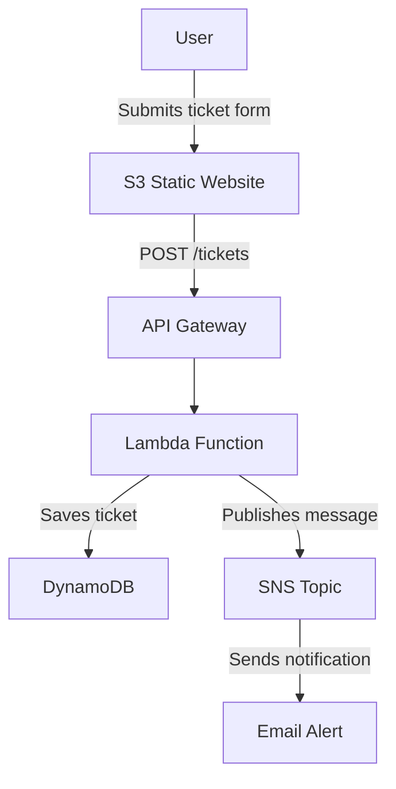

# Serverless IT Helpdesk Ticketing System

🔗 **Live Demo:** http://cjgragasin.projects.s3-website-ap-southeast-1.amazonaws.com/

## What it does
A serverless ticketing system where users submit IT support tickets through a web form.
Tickets are stored in DynamoDB and trigger email notifications via SNS.

## Architecture
- **S3** — hosts static HTML frontend
- **API Gateway** — REST API endpoint (POST /tickets)
- **Lambda (Python)** — processes ticket submissions
- **DynamoDB** — stores ticket records
- **SNS** — sends email notifications on new tickets

## Tech Stack
Python 3.13, boto3, AWS Lambda, API Gateway, DynamoDB, SNS, S3

## Architecture Diagram
## Architecture

## Future Improvements
- Add Cognito for user authentication
- Use least-privilege IAM policies instead of FullAccess
- Add HTTPS via CloudFront

## How it works
1. User fills out a web form hosted on S3
2. Form submits data via fetch() to API Gateway REST endpoint
3. API Gateway triggers a Lambda function (Python)
4. Lambda generates a unique ticket ID and saves the ticket to DynamoDB
5. Lambda publishes a notification to SNS, which emails the support team

## Tech Stack
- Python 3.13 + boto3 (AWS SDK)
- AWS Lambda
- API Gateway (REST API)
- DynamoDB
- SNS (email notifications)
- S3 (static website hosting)
